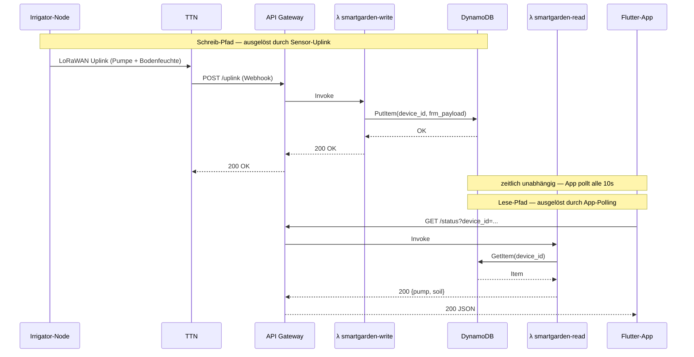

# ADR-005 — AWS-Backend als paralleler Lernpfad (DynamoDB + Lambda + API Gateway)

**Datum:** Juni 2026
**Status:** Umgesetzt (parallel zu Firebase, kein Ersatz)
**Autor:** Oliver Schmoll
**Betrifft:** Backend — Gerätestatus-Speicherung & -Abfrage für die Flutter-App

---

## Kontext

Der bestehende Daten-Pfad (TTN-Webhook → Firebase Realtime Database → Flutter-App,
siehe [hardware-overview.md](hardware-overview.md) Bring-up-Berichte) funktioniert
zuverlässig. Firebase ist als Google-Produkt jedoch bereits bekannt — AWS war es
nicht. Ziel dieses ADRs ist **kein technischer Ersatz**, sondern ein bewusster
**Lernpfad**: den gleichen Anwendungsfall (Gerätestatus speichern + abrufen) einmal
mit AWS-Bausteinen nachzubauen, um die Kernkonzepte (API Gateway, Lambda, DynamoDB,
IAM-Rollen, CORS) praktisch zu verstehen.

Beide Pfade laufen **parallel** — die Flutter-App zeigt Firebase- und AWS-Daten
nebeneinander an (siehe `app/mobile/lib/main.dart`, Sektionen "Bewässerung" und
"Bewässerung (AWS)").

---

## Architektur

```
TTN-Webhook (Uplink message)
        │
        │ HTTP POST /uplink
        ▼
  API Gateway (HTTP API, smartgarden-api)
        │
        ▼
  Lambda: smartgarden-write
        │
        │ PutItem
        ▼
  DynamoDB: smartgarden-devices (Partition Key: device_id)
        │
        │ GetItem
        ▼
  Lambda: smartgarden-read
        │
        ▲
        │ HTTP GET /status?device_id=...
        │
  API Gateway (gleiche API, andere Route)
        │
        ▲
   Flutter-App (periodischer Poll alle 10s)
```

### Sequenzdiagramm — Schreib- und Lese-Pfad

Beide Abläufe sind **zeitlich unabhängig** voneinander — sie teilen sich nur
DynamoDB als gemeinsamen Speicher. Das ist auch der Hauptgrund für zwei getrennte
Lambda-Funktionen statt einer (siehe Begründung unten).



---

## Entscheidung & Begründung

### Warum DynamoDB (statt z.B. RDS/PostgreSQL)?

- **Schema-los, ein Datensatz pro Gerät** — passt zum Anwendungsfall "letzter
  bekannter Status pro `device_id`", keine relationalen Abfragen nötig
- **On-Demand-Kapazitätsmodus** — kein Server-Provisioning, kein Kostenrisiko bei
  einem PoC mit wenigen Anfragen/Tag
- **Direktes Pendant zu Firebase RTDB**: Key-Value-artiger Zugriff (`device_id` →
  letzter Datensatz), genau wie `devices/<id>/latest` bei Firebase — erleichtert
  den 1:1-Vergleich beim Lernen

### Warum Lambda (statt z.B. einer EC2-Instanz oder Container)?

- **Serverless** — kein Betriebssystem/Server zu warten, läuft nur, wenn ein
  Request kommt (kosteneffizient bei sporadischen Uplinks alle 60s-15min)
- **Direkte Integration mit API Gateway** — ein paar Klicks statt eigenem
  Webserver-Setup
- Node.js-Laufzeit enthält das **AWS SDK v3 bereits vorinstalliert**
  (`@aws-sdk/client-dynamodb`) — kein eigenes Dependency-Management/Layer nötig
  für diesen einfachen Anwendungsfall

### Was macht jede Lambda-Funktion konkret?

Quellcode liegt im Repo unter [`backend/aws-lambda/`](../../backend/aws-lambda/)
(Referenz/Backup — Deployment läuft aktuell manuell über die AWS Console, siehe
dortige README).

| Funktion | Trigger | Aufgabe |
|---|---|---|
| [`smartgarden-write/index.mjs`](../../backend/aws-lambda/smartgarden-write/index.mjs) | `POST /uplink` (von TTN-Webhook) | Empfängt das TTN-Uplink-JSON, extrahiert `device_id` und `frm_payload` (Base64-kodierte Sensordaten), schreibt sie als einen Datensatz in DynamoDB (`PutItem`, überschreibt den vorherigen Stand für dieses Gerät) |
| [`smartgarden-read/index.mjs`](../../backend/aws-lambda/smartgarden-read/index.mjs) | `GET /status?device_id=...` (von der Flutter-App) | Liest den aktuellen Datensatz für die angegebene `device_id` aus DynamoDB (`GetItem`) und gibt ihn als JSON zurück |

### Warum zwei getrennte Lambda-Funktionen (Write/Read) statt einer?

- **Trennung der Verantwortlichkeiten**: Schreiben (von TTN, vertrauenswürdige
  Quelle, kein Nutzer-Input) und Lesen (von der App, potenziell öffentlich
  erreichbar) haben unterschiedliche Sicherheits- und Skalierungsanforderungen
- **Unabhängiges Debugging/Testen**: Jede Funktion lässt sich isoliert über die
  Lambda-Konsole mit einem Test-Event prüfen, ohne den anderen Pfad zu berühren
  (genau das hat während des Aufbaus geholfen, den CORS- und Logging-Fehler
  einzukreisen)
- **Unterschiedliche IAM-Berechtigungen möglich** (in dieser PoC-Version beide mit
  `AmazonDynamoDBFullAccess` vereinfacht — siehe "Offene Punkte" unten für die
  korrekte, engere Aufteilung)

### Warum API Gateway (HTTP API, nicht REST API)?

- **HTTP API ist einfacher und günstiger** als die ältere "REST API"-Variante in
  API Gateway, für unseren Zweck (einfache Lambda-Proxy-Routen) reicht der
  Funktionsumfang vollständig aus
- Zwei Routen auf derselben API: `POST /uplink` (Write) und `GET /status` (Read) —
  beide nutzen automatisches Deployment auf die `$default`-Stage

---

## Offene Punkte / bewusste Vereinfachungen für den PoC

- **IAM-Berechtigungen sind zu breit**: Beide Lambda-Rollen haben
  `AmazonDynamoDBFullAccess` (Zugriff auf alle DynamoDB-Tabellen im Account) statt
  einer auf `smartgarden-devices` + die konkret nötige Aktion (`PutItem` bzw.
  `GetItem`) beschränkten Inline-Policy. Für einen Lernpfad bewusst in Kauf
  genommen, um nicht an IAM-Policy-Syntax aufzuhalten — vor einem produktiven
  Einsatz nachschärfen.
- **CORS ist auf `*` (alle Origins) offen** — für den PoC/Web-Test in Chrome
  nötig, sollte für eine echte Veröffentlichung auf die konkrete App-Domain
  eingeschränkt werden.
- **Kein API-Key/Auth auf den Endpunkten** — `/uplink` und `/status` sind aktuell
  von jedem im Internet aufrufbar, der die URL kennt (gleiches Risiko wie die
  offenen Firebase-Rules, siehe Diskussion zu Firebase-Security).
- **Kein Vergleich der laufenden Kosten** zwischen Firebase und AWS wurde
  angestellt — bei diesem PoC-Volumen (alle 60s ein Uplink) dürften beide
  praktisch kostenlos im Free-Tier-Bereich bleiben.

---

## Lessons Learned beim Aufbau

- **Region-Konsistenz**: Lambda, DynamoDB und API Gateway müssen in derselben
  AWS-Region liegen (hier: `eu-central-1`) — IAM-Rollen sind dagegen global und
  zeigen in der Konsole-URL teils `us-east-1`, was zunächst verwirrend war, aber
  unkritisch ist.
- **API-Gateway-Routen-Reihenfolge**: Eine Integration (Lambda-Funktion) muss
  *vor* dem Anlegen einer Route existieren, sonst lässt sich im Wizard keine
  Route mit Ziel auswählen.
- **CORS wird leicht übersehen**: Die Lambda-Funktionen selbst liefen fehlerfrei
  (per direktem `curl`-Test bestätigt) — das Problem zeigte sich erst beim
  Zugriff aus dem Browser (Flutter-Web), weil API Gateway ohne explizite
  CORS-Konfiguration keine `Access-Control-Allow-Origin`-Header sendet.
- **Debugging via CloudWatch Logs**: Ein einfaches `console.log(JSON.stringify(event))`
  am Anfang der Lambda-Funktion war der schnellste Weg, die tatsächliche
  TTN-Webhook-Payload-Struktur zu verifizieren, statt sie nur zu vermuten.

---

## Referenzen

- `app/mobile/lib/main.dart` — Flutter-App mit beiden parallelen Datenpfaden
- [hardware-overview.md](hardware-overview.md) — Firebase-Pfad (bestehender PoC)
- AWS-Ressourcen (Region `eu-central-1`):
  - DynamoDB-Tabelle: `smartgarden-devices`
  - Lambda-Funktionen: `smartgarden-write`, `smartgarden-read`
  - API Gateway: `smartgarden-api` (`https://e3trf6ld2j.execute-api.eu-central-1.amazonaws.com`)
