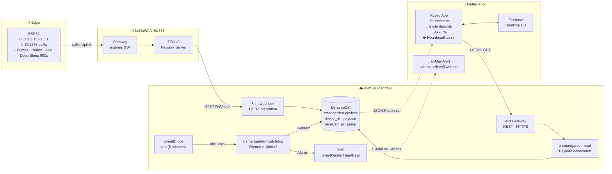

# SmartGarden — Cloud Architektur

## Datenfluss

| Pfad | Beschreibung |
|---|---|
| ESP32 → TTN → Lambda → DynamoDB | Uplink-Daten landen in der DB |
| Flutter → API Gateway → Lambda → DynamoDB | App liest aktuellen Status |
| EventBridge → Watchdog → DynamoDB | Alle 5min: Silence-Check |
| Watchdog → SNS → E-Mail | Alarm wenn Device > 30min still |

## TX-Intervalle

| Zustand | Intervall |
|---|---|
| Normal (Sleep) | 900s (15min) |
| Pumpe aktiv | 15s |
| Watchdog-Prüfung | 300s (5min) |
| Alarm-Schwelle | 1800s (30min) |
