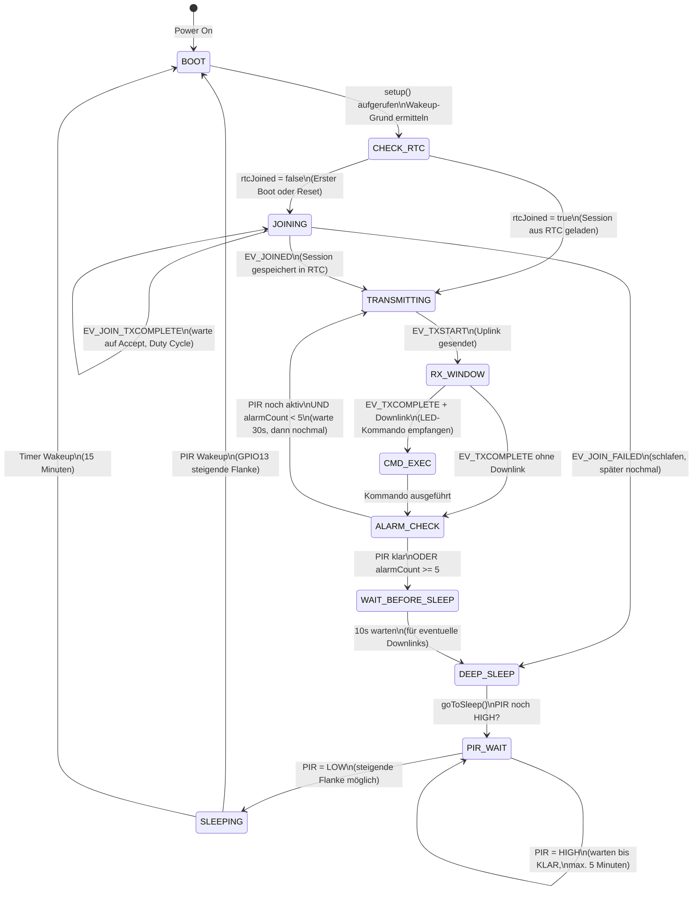
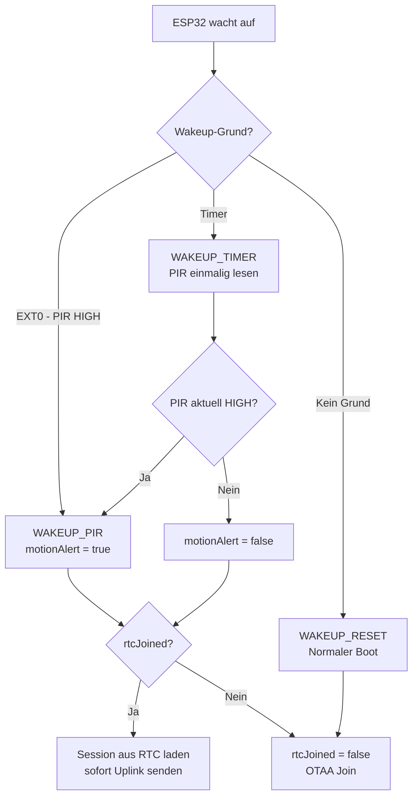
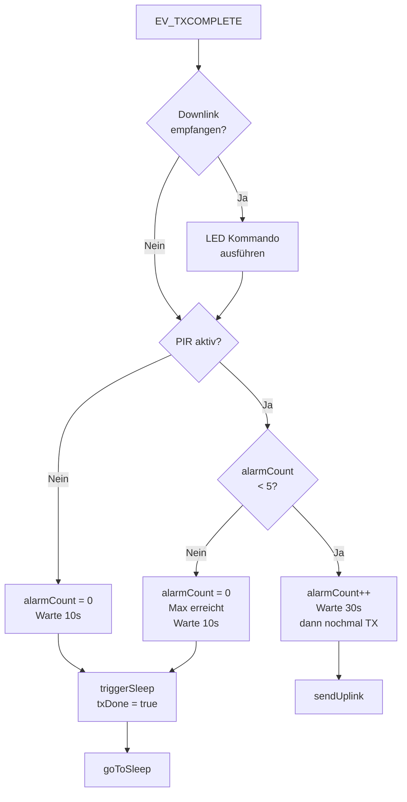

# Firmware State Machine & Systemsequenz

## Guard Node v0.2 (Deep Sleep + PIR Wakeup)

---

## 1. Haupt-State Machine (Deep Sleep Zyklus)

---

## 2. Wakeup-Logik

---

## 3. Alarm-Logik nach TX

---

## 4. Zustandsbeschreibung

| Zustand | Beschreibung | OLED-Anzeige |
|---------|-------------|--------------|
| `BOOT` | setup() aufgerufen, Hardware init | "SmartGarden Guard v0.2" |
| `CHECK_RTC` | Wakeup-Grund prüfen, RTC-Daten laden | — |
| `JOINING` | OTAA Join-Request, warte auf Accept | "Join TTN..." |
| `TRANSMITTING` | Uplink wird gesendet | "Sende Uplink..." |
| `RX_WINDOW` | RX1/RX2 Fenster offen (5-6s nach TX) | — |
| `CMD_EXEC` | LED-Kommando ausführen | "Downlink! LED: AN/AUS" |
| `ALARM_CHECK` | PIR-Status prüfen, alarmCount auswerten | — |
| `WAIT_BEFORE_SLEEP` | 10s warten für eventuelle Downlinks | "Warte 10s... Deep Sleep" |
| `PIR_WAIT` | Warten bis PIR=LOW vor Sleep | "Warte auf KLAR" |
| `SLEEPING` | Deep Sleep (~0.15mA) | Display aus |

---

## 5. RTC-Speicher (überlebt Deep Sleep)

| Variable | Typ | Inhalt |
|----------|-----|--------|
| `rtcJoined` | bool | Session gültig? |
| `rtcNwkSKey` | uint8_t[16] | Network Session Key |
| `rtcAppSKey` | uint8_t[16] | Application Session Key |
| `rtcDevAddr` | uint32_t | Temporäre TTN-Adresse |
| `rtcSeqnoUp` | uint32_t | Uplink Frame Counter |
| `rtcSeqnoDn` | uint32_t | Downlink Frame Counter |
| `rtcLedState` | bool | LED an/aus |
| `rtcAlarmCount` | uint8_t | Anzahl Alarm-Uplinks (max. 5) |

> **Wichtig:** `rtcSeqnoUp` und `rtcSeqnoDn` müssen gespeichert werden — TTN verwirft Pakete mit zu niedrigem Counter als Replay-Angriff.

---

## 6. Energiebudget Guard v0.2

| Zustand | Strom | Dauer | Energie/Wakeup |
|---------|-------|-------|----------------|
| Deep Sleep | ~0.15 mA | ~15 min | ~0.56 mAh |
| Boot + LMIC init | ~80 mA | ~0.5s | ~0.01 mAh |
| TX Uplink | ~120 mA | ~0.2s | ~0.007 mAh |
| RX Fenster | ~12 mA | ~1s | ~0.003 mAh |
| **Gesamt pro Zyklus** | | | **~0.58 mAh** |
| **Tagesverbrauch** | | 96 Zyklen | **~55 mAh/Tag** |
| **2× 18650 (5000 mAh)** | | | **~90 Tage** |

> Bei PIR-Alarm: bis zu 5 Uplinks × 30s = max. 2.5 Minuten aktiv → ca. 5 mAh pro Alarm-Ereignis.

---

## 7. Payload-Format

### Uplink (Node → TTN, FPort 1)

| Byte | Wert | Bedeutung |
|------|------|-----------|
| 0 | `0x00` | LED aus |
| 0 | `0x01` | LED an |
| 1 | `0x00` | Kein Alarm |
| 1 | `0x01` | Bewegung erkannt |

### Downlink (TTN → Node, FPort 1)

| Byte | Wert | Bedeutung |
|------|------|-----------|
| 0 | `0x00` | LED ausschalten |
| 0 | `0x01` | LED einschalten |
| 0 | `0x02` | LED toggeln |

---

## 8. Bekannte Einschränkungen

| Problem | Ursache | Status |
|---------|---------|--------|
| Join dauert 1-5 Min | EU868 Duty Cycle + Gateway-Timing | ✅ durch RTC-Session gelöst (nach erstem Join) |
| PIR HIGH → kein Wakeup | EXT0 nur bei steigender Flanke | ✅ gefixt: warten bis PIR=LOW vor Sleep |
| Endless Alarm-Loop | PIR dauerhaft aktiv | ✅ gefixt: max. 5 Alarm-Uplinks |
| SF10 nach ADR | ADR passt Rate an | ✅ ADR deaktiviert (festes SF9) |
| Downlink sporadisch | Gateway Duty Cycle / Timing | ⚠️ LoRaWAN by design (best-effort) |
