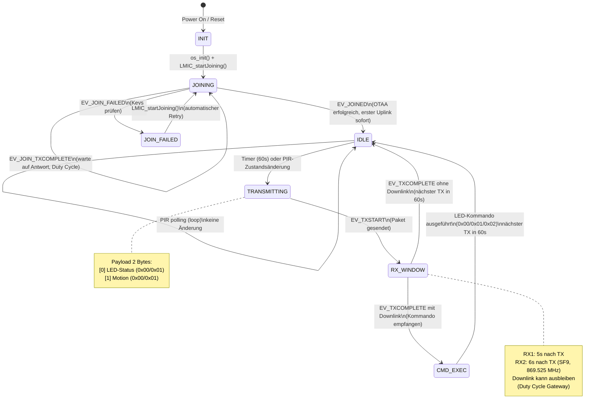
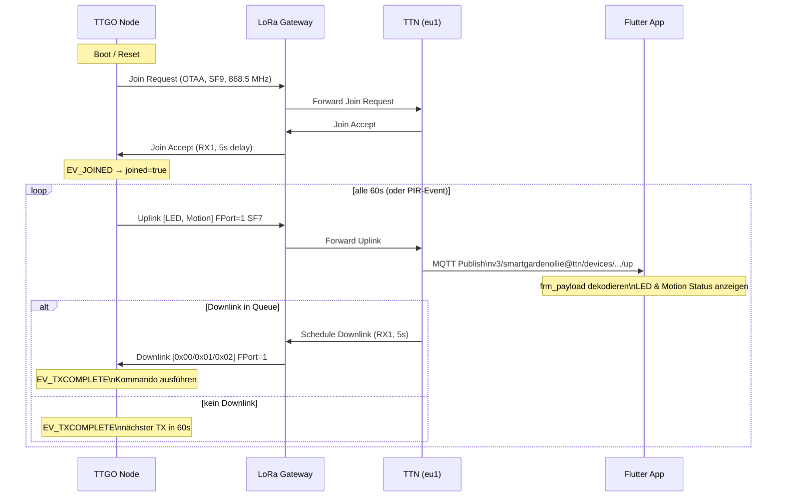
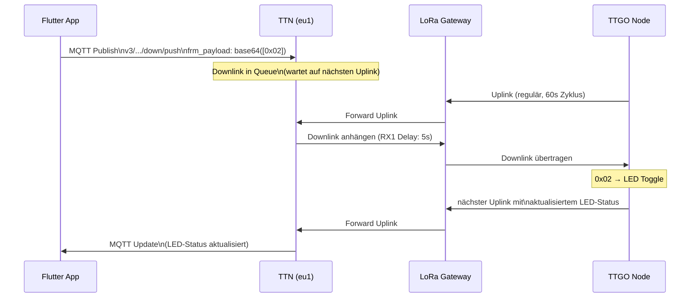

# Firmware State Machine & Systemsequenz — Sensor Node v0.1

## 1. State Machine (LMIC + PIR)

Der Node durchläuft folgende Zustände:



### Zustandsbeschreibung

| Zustand | Beschreibung | OLED-Anzeige |
|---------|-------------|--------------|
| `INIT` | Hardware-Init, LMIC-Setup, EU868-Kanäle | "Initialisiere..." |
| `JOINING` | OTAA Join-Request wird gesendet, warte auf Accept | "Verbinde TTN..." |
| `JOIN_FAILED` | Join fehlgeschlagen (falsche Keys) | "JOIN FAILED!" |
| `IDLE` | Verbunden, warte auf Timer oder PIR-Event | "TX OK / RSSI: x dBm" |
| `TRANSMITTING` | Uplink wird über LoRa gesendet | "Sende Uplink..." |
| `RX_WINDOW` | Empfangsfenster offen (RX1/RX2) | — |
| `CMD_EXEC` | Downlink-Kommando wird ausgeführt | "Downlink RX!" |

### PIR-Logik (Polling im Loop)

```
loop() jeden Tick:
  pirNow = digitalRead(PIR_PIN)
  if pirNow != motionLastState:
    motionLastState = pirNow
    motionAlert = pirNow
    if NOT TXRXPEND:
      → sofortiger Uplink (überspringt 60s-Timer)
```

---

## 2. Sequenzdiagramm — Uplink & Downlink



### Downlink-Pfad (Flutter → Node)



---

## 3. Payload-Format

### Uplink (Node → TTN, FPort 1)

| Byte | Wert | Bedeutung |
|------|------|-----------|
| 0    | `0x00` | LED aus |
| 0    | `0x01` | LED an |
| 1    | `0x00` | Kein Bewegungsalarm |
| 1    | `0x01` | Bewegung erkannt (PIR HIGH) |

### Downlink (TTN → Node, FPort 1)

| Byte | Wert | Bedeutung |
|------|------|-----------|
| 0    | `0x00` | LED ausschalten |
| 0    | `0x01` | LED einschalten |
| 0    | `0x02` | LED toggeln |

---

## 4. Timing-Übersicht

| Parameter | Wert | Hinweis |
|-----------|------|---------|
| TX-Intervall | 60s (PoC) / 900s (Produktion) | Duty Cycle: ~0.08% |
| Join SF | SF9 | Robuster als SF7 für ersten Join |
| Data SF | SF7BW125 | ADR passt automatisch an |
| RX1 Delay | 5s | TTN Standard |
| Downlink-Zustellung | 1–3 TX-Zyklen | Gateway Duty Cycle abhängig |
