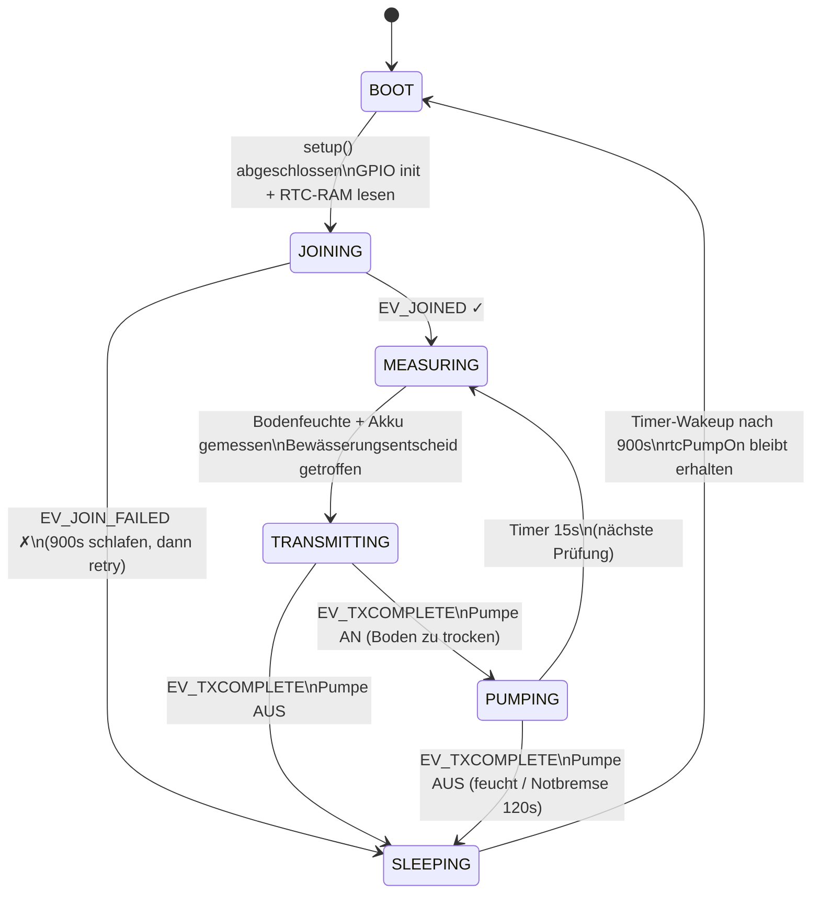
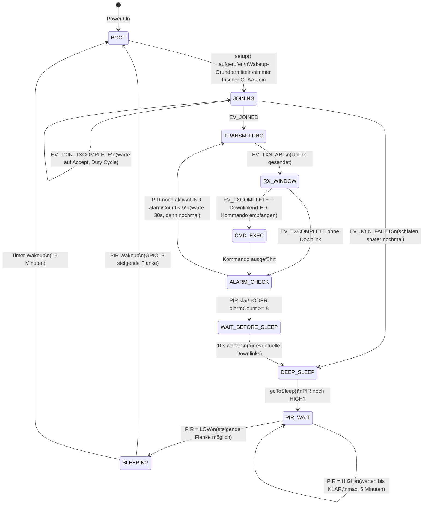
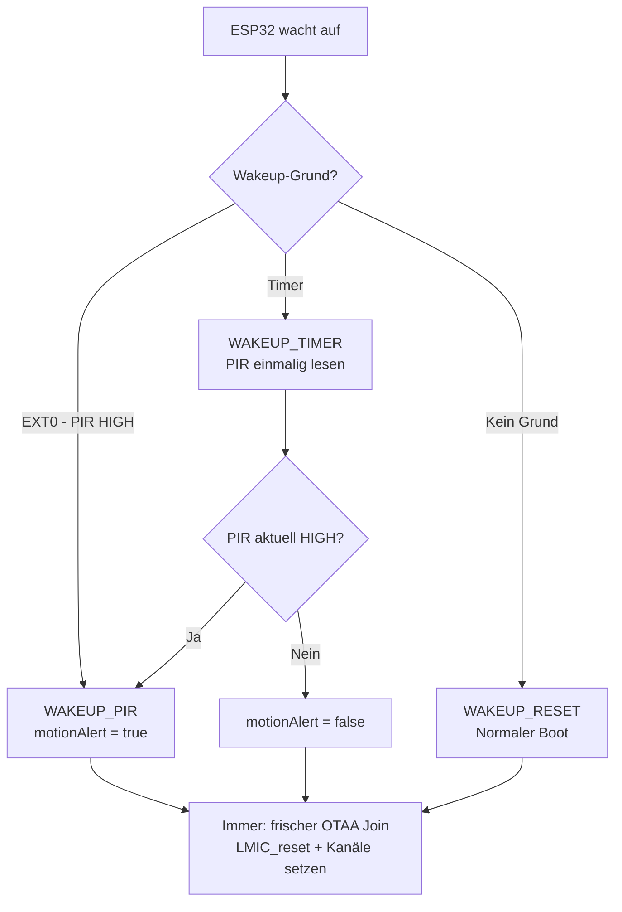
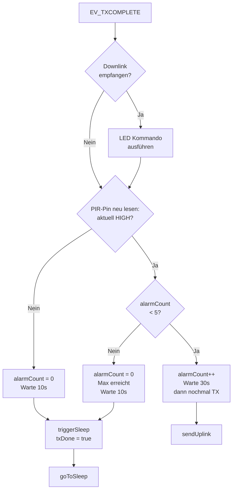

# Firmware State Machine & Systemsequenz

## Irrigator Node v0.4 (OTAA + Deep Sleep + Bewässerung)

Ablauf: **Boot → OTAA-Join → Messen → Senden → Deep Sleep → repeat**  
Pumpe aktiv: kein Sleep, alle 15s Prüfzyklus (Notbremse nach 120s).

### Zustände

| Zustand | Dauer | Strom | Beschreibung |
|---|---|---|---|
| **BOOT** | ~500ms | ~80mA | GPIO init, RTC-RAM lesen, LMIC init |
| **JOINING** | 5–10s | ~80mA | OTAA Join via TTN (jeder Zyklus) |
| **MEASURING** | ~100ms | ~80mA | GPIO34 Bodenfeuchte + GPIO35 Batterie + Bewässerungsentscheid |
| **TRANSMITTING** | ~2–4s | ~120mA | LoRa Uplink 5 Bytes (Pumpe + Boden + Akku mV) |
| **PUMPING** | max. 120s | ~80mA | Pumpe läuft, alle 15s → MEASURING → TRANSMITTING |
| **SLEEPING** | 900s | ~5.5mA | Deep Sleep (AMS1117-LDO läuft mit) |

### Payload (5 Bytes, FPort 1)

| Byte | Inhalt | Format |
|---|---|---|
| 0 | Pumpenstatus | `0x00` = AUS · `0x01` = AN |
| 1–2 | Bodenfeuchte ADC-Rohwert | 16-bit big-endian |
| 3–4 | Batteriespannung | 16-bit big-endian in mV |

### RTC-RAM

| Variable | Inhalt |
|---|---|
| `rtcPumpOn` | Pumpzustand vor Sleep — wird nach Wakeup sofort wiederhergestellt |

> LoRaWAN-Session-Persistenz (Keys, Frame Counter) wurde entfernt — TTN v3 verwirft
> Uplinks bei Frame-Counter-Inkonsistenz nach Restore. Frischer OTAA-Join je Zyklus
> ist zuverlässiger (gleiche Erfahrung wie beim Guard Node, siehe unten).

---

## Guard Node v0.2 (Deep Sleep + PIR Wakeup)

---

## 1. Haupt-State Machine (Deep Sleep Zyklus)

---

## 2. Wakeup-Logik

> **Hinweis:** Eine RTC-Session-Persistenz (Frame Counter / Session Keys über
> Deep Sleep hinweg speichern) wurde **bewusst entfernt** — sie führte dazu,
> dass der TTN Network Server Uplinks nach dem Restore still verwarf
> (Frame-Counter-/Kanalzustand passte nicht zu dem, was der Server erwartete).
> Da der Knoten ein eigenes Gateway in Reichweite hat, ist ein frischer
> OTAA-Join nach jedem Wakeup (~5s) zuverlässiger als RTC-Restore und nur
> minimal langsamer.

---

## 3. Alarm-Logik nach TX

> **Fix:** `motionAlert` wurde früher nur einmal beim Boot gesetzt und nie
> aktualisiert — dadurch blieb der Knoten in der Alarm-Eskalation hängen,
> selbst wenn die Bewegung längst vorbei war. Jetzt wird der PIR-Pin direkt
> vor dieser Entscheidung neu eingelesen, sodass "KLAR" zuverlässig zum
> Schlafen führt.

---

## 4. Zustandsbeschreibung

| Zustand | Beschreibung | OLED-Anzeige |
|---------|-------------|--------------|
| `BOOT` | setup() aufgerufen, Hardware init, Wakeup-Grund prüfen | "SmartGarden Guard v0.2" |
| `JOINING` | OTAA Join-Request, warte auf Accept (immer, jeder Zyklus) | "Join TTN..." |
| `TRANSMITTING` | Uplink wird gesendet | "Sende Uplink..." |
| `RX_WINDOW` | RX1/RX2 Fenster offen (5-6s nach TX) | — |
| `CMD_EXEC` | LED-Kommando ausführen | "Downlink! LED: AN/AUS" |
| `ALARM_CHECK` | PIR-Status prüfen, alarmCount auswerten | — |
| `WAIT_BEFORE_SLEEP` | 10s warten für eventuelle Downlinks | "Warte 10s... Deep Sleep" |
| `PIR_WAIT` | Warten bis PIR=LOW vor Sleep | "Warte auf KLAR" |
| `SLEEPING` | Deep Sleep (~0.15mA) | Display aus |

---

## 5. RTC-Speicher (überlebt Deep Sleep)

LoRaWAN-Session-Persistenz (Keys, DevAddr, Frame Counter) wurde **entfernt** —
siehe Hinweis in Abschnitt 2. Übrig bleiben nur die Werte, die unabhängig
vom Funk-Stack über den Sleep hinweg erhalten bleiben sollen:

| Variable | Typ | Inhalt |
|----------|-----|--------|
| `rtcLedState` | bool | LED an/aus |
| `rtcAlarmCount` | uint8_t | Anzahl Alarm-Uplinks (max. 5) |

---

## 6. Energiebudget Guard v0.2

| Zustand | Strom | Dauer | Energie/Wakeup |
|---------|-------|-------|----------------|
| Deep Sleep | ~0.15 mA | ~15 min | ~0.56 mAh |
| Boot + LMIC init | ~80 mA | ~0.5s | ~0.01 mAh |
| **OTAA Join (Request + Accept-RX)** | ~100 mA | ~5-8s | **~0.15 mAh** |
| TX Uplink | ~120 mA | ~0.2s | ~0.007 mAh |
| RX Fenster | ~12 mA | ~1s | ~0.003 mAh |
| **Gesamt pro Zyklus** | | | **~0.73 mAh** |
| **Tagesverbrauch** | | 96 Zyklen | **~70 mAh/Tag** |
| **2× 18650 (5000 mAh)** | | | **~70 Tage** |

> Gegenüber RTC-Session-Restore kostet der Join pro Zyklus zusätzliche
> Energie (~0.15 mAh) — bei einem Knoten mit eigenem Gateway in Reichweite
> ist dieser Mehrverbrauch der Preis für deutlich höhere Zuverlässigkeit
> (siehe Abschnitt 2) und in der Praxis vernachlässigbar.

> Bei PIR-Alarm: bis zu 5 Uplinks × 30s = max. 2.5 Minuten aktiv → ca. 5 mAh pro Alarm-Ereignis.

---

## 7. Payload-Format

### Uplink (Node → TTN, FPort 1)

| Byte | Wert | Bedeutung |
|------|------|-----------|
| 0 | `0x00` | LED aus |
| 0 | `0x01` | LED an |
| 1 | `0x00` | Kein Alarm |
| 1 | `0x01` | Bewegung erkannt |

### Downlink (TTN → Node, FPort 1)

| Byte | Wert | Bedeutung |
|------|------|-----------|
| 0 | `0x00` | LED ausschalten |
| 0 | `0x01` | LED einschalten |
| 0 | `0x02` | LED toggeln |

---

## 8. Bekannte Einschränkungen

| Problem | Ursache | Status |
|---------|---------|--------|
| Join dauert 1-5 Min | EU868 Duty Cycle + Gateway-Timing | ✅ durch eigenes Gateway in Reichweite kein Problem (Join < 10s) |
| RTC-Session-Restore verwirft Uplinks | Frame-Counter-/Kanalzustand nach Restore inkonsistent mit Network Server | ✅ entfernt — stattdessen frischer OTAA-Join nach jedem Wakeup |
| PIR HIGH → kein Wakeup | EXT0 nur bei steigender Flanke | ✅ gefixt: warten bis PIR=LOW vor Sleep |
| Endless Alarm-Loop | `motionAlert` wurde nur beim Boot gesetzt, nie aktualisiert | ✅ gefixt: PIR-Pin wird vor jeder Eskalations-Entscheidung neu gelesen; zusätzlich max. 5 Alarm-Uplinks als Notbremse |
| SF10 nach ADR | ADR passt Rate an | ✅ ADR deaktiviert (festes SF9) |
| Downlink sporadisch | Gateway Duty Cycle / Timing | ⚠️ LoRaWAN by design (best-effort) |
