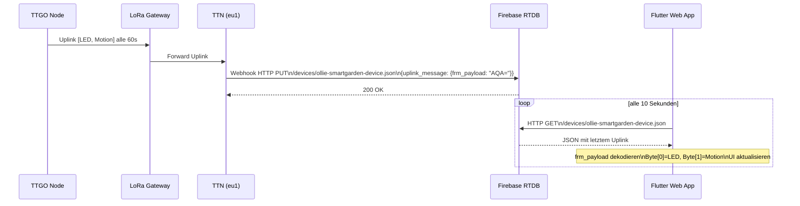
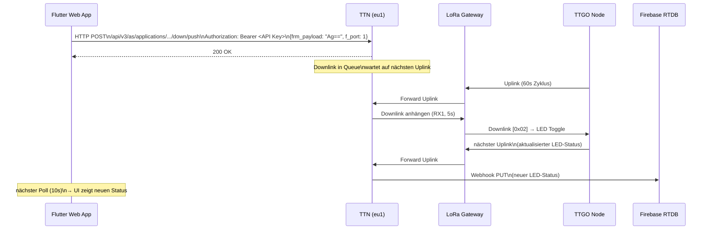

# Web App Architektur — SmartGarden PoC v0.1

## Überblick

Die SmartGarden Web App zeigt den Live-Status des Sensor Nodes und erlaubt die LED-Fernsteuerung über den Browser (Desktop & Smartphone). Die Kommunikation läuft über TTN → Firebase Realtime Database → Flutter Web App.

---

## Architektur

```
┌─────────────────┐     LoRa      ┌─────────────┐    Webhook    ┌──────────────────────┐
│  TTGO LoRa32    │ ──────────── ▶ │  TTN eu1    │ ────────────▶ │  Firebase Realtime   │
│  Sensor Node    │               │  Gateway    │    HTTP PUT   │  Database            │
└─────────────────┘               └─────────────┘               └──────────────────────┘
                                        │                                  │
                                        │  HTTP POST                       │ HTTP GET
                                        │  (Downlink)                      │ (Polling 10s)
                                        ▼                                  ▼
                                  ┌─────────────┐               ┌──────────────────────┐
                                  │  LoRa       │               │  Flutter Web App     │
                                  │  Gateway    │               │  Firebase Hosting    │
                                  └─────────────┘               └──────────────────────┘
                                        │
                                        │  LoRa Downlink
                                        ▼
                                  ┌─────────────┐
                                  │  TTGO Node  │
                                  └─────────────┘
```

---

## Sequenzdiagramm — Status lesen (Uplink)



---

## Sequenzdiagramm — LED steuern (Downlink)



---

## Datenfluss Details

### TTN → Firebase (Webhook)

| Parameter | Wert |
|-----------|------|
| Typ | Custom Webhook |
| Method | PUT |
| URL | `https://smartgarden-app-ollie-default-rtdb.europe-west1.firebasedatabase.app/devices/ollie-smartgarden-device.json` |
| Trigger | Uplink message |
| Auth | keine (Firebase Rules: test mode) |

TTN schreibt jeden Uplink als neuen Eintrag mit Push-Key (zufällige ID) unter `devices/ollie-smartgarden-device/`.

### Firebase → Flutter App (Polling)

Die App liest alle 10s den gesamten Device-Knoten und extrahiert den letzten Eintrag:

```dart
final url = '$firebaseDbUrl/devices/$ttnDeviceId.json';
// Response: { "-OtrQDMVBvnn3zHQTsh4": { uplink_message: {...} }, ... }
// Letzter Eintrag = aktuellster Status
```

### Flutter App → TTN (Downlink REST API)

```
POST https://eu1.cloud.thethings.network/api/v3/as/applications/{app_id}/devices/{device_id}/down/push
Authorization: Bearer <TTN API Key>
Content-Type: application/json

{
  "downlinks": [{
    "frm_payload": "Ag==",   // base64([0x02]) = Toggle
    "f_port": 1,
    "priority": "NORMAL"
  }]
}
```

---

## Payload-Format

### frm_payload (base64 dekodiert)

| Byte | Wert | Bedeutung |
|------|------|-----------|
| 0 | `0x00` | LED aus |
| 0 | `0x01` | LED an |
| 1 | `0x00` | Keine Bewegung |
| 1 | `0x01` | Bewegung erkannt |

### Downlink Kommandos

| base64 | Hex | Aktion |
|--------|-----|--------|
| `AA==` | `0x00` | LED aus |
| `AQ==` | `0x01` | LED an |
| `Ag==` | `0x02` | LED toggle |

---

## Deployment

- **Hosting**: Firebase Hosting (kostenlos, Spark Plan)
- **URL**: https://smartgarden-app-ollie.web.app
- **Build**: `flutter build web`
- **Deploy**: `firebase deploy`

## Bekannte Einschränkungen

- **Polling statt Push**: Status wird alle 10s gelesen — kein Echtzeit-Push
- **Firebase Rules**: Aktuell im Test-Mode (öffentlich les-/schreibbar) — vor Produktiveinsatz absichern
- **Downlink-Verzögerung**: LED-Befehl wird erst beim nächsten Uplink-Zyklus (max. 60s) zugestellt
